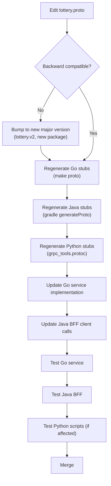
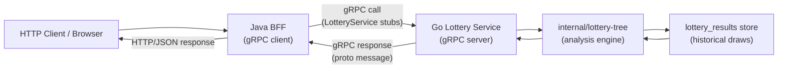
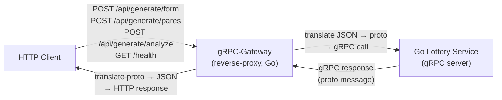

# Flows

Mermaid diagrams for the proto contract lifecycle and runtime call flows.

## 1. Proto Change Flow

How a change to the contract propagates through all consumers. Every change to `lottery.proto` must regenerate all language stubs and test every service before merging.

## 2. gRPC Call Flow

The Java BFF calls the Go lottery service using the generated gRPC stubs. The proto contract is the only thing both sides share.

### RPCs over gRPC
| RPC | Direction | Purpose |
|-----|-----------|---------|
| `HealthCheck` | BFF → Go | Liveness and draw count |
| `GenerateForm` | BFF → Go | Generate number combinations |
| `GetStatistics` | BFF → Go | Frequent pairs/groups |
| `Analyze` | BFF → Go | Evaluate user form vs. history |

## 3. REST Gateway Flow

The Go service runs the gRPC-Gateway reverse-proxy, translating HTTP/JSON requests into gRPC calls using the `google.api.http` annotations in `lottery.proto`. This lets HTTP clients use the same contract without a gRPC client.

### REST Mappings
| HTTP Method | Path | RPC | Body |
|-------------|------|-----|------|
| `GET` | `/health` | `HealthCheck` | — |
| `POST` | `/api/generate/form` | `GenerateForm` | `*` |
| `POST` | `/api/generate/pares` | `GetStatistics` | `*` |
| `POST` | `/api/generate/analyze` | `Analyze` | `*` |
